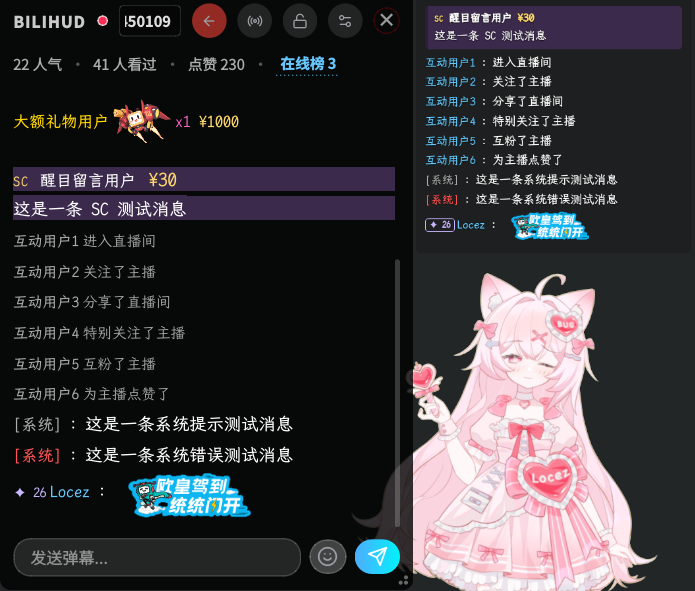
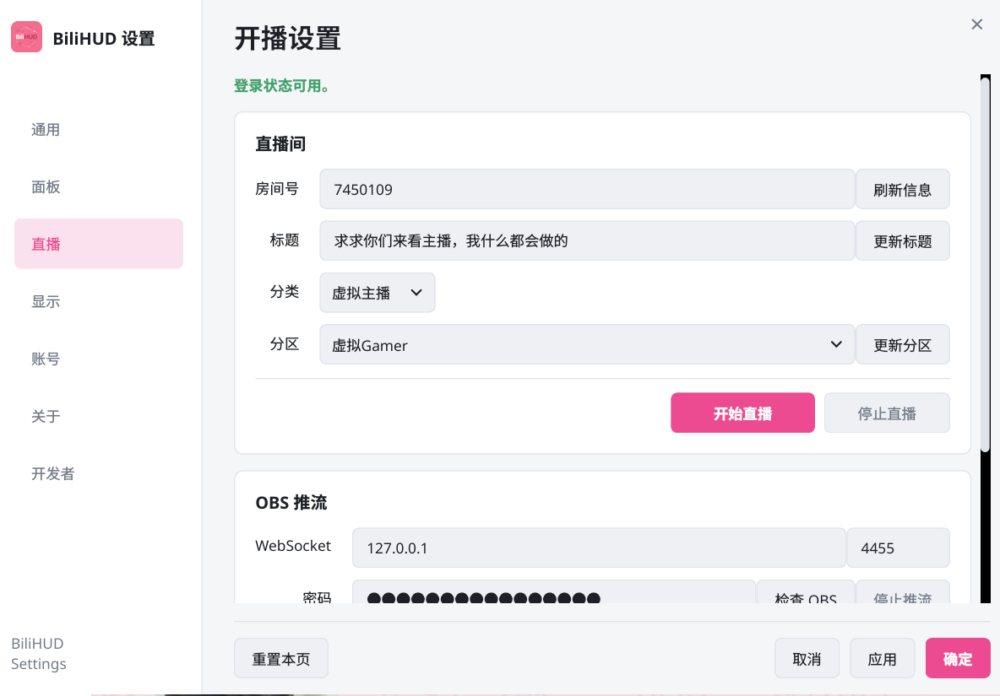

# BiliHUD

[](https://pypi.org/project/bilihud/)
[](https://github.com/locez/bilihud/actions/workflows/test.yml)
[](https://github.com/locez/bilihud/releases/latest)
[](https://pypi.org/project/bilihud/)
[](https://www.python.org/)
[](https://github.com/locez/bilihud)
[](https://opensource.org/licenses/MIT)

BiliHUD 是一个基于 [PyQt6](https://pypi.org/project/PyQt6/) 和 [blivedm](https://github.com/xfgryujk/blivedm) 的跨平台 B 站直播弹幕阅读器。它可以在 Linux KDE 全屏游戏上方显示弹幕，也可以在 Windows 和 macOS 上使用通用 Qt 窗口；所有平台都支持将弹幕同步到 OBS 浏览器源。

> [!NOTE]
> 项目仍在快速迭代，目前只在有限环境下测试。如果遇到问题，欢迎提交 [Issue](https://github.com/locez/bilihud/issues)。

## 界面预览

| 一般模式 | 游戏穿透模式 | 直播控制与 OBS |
| --- | --- | --- |
|  |  |  |

## 目录

- [界面预览](#界面预览)
- [功能](#功能)
- [运行环境](#运行环境)
- [安装](#安装)
- [启动与使用](#启动与使用)
- [隐私与配置](#隐私与配置)
- [鸣谢](#鸣谢)

## 功能

### 弹幕与窗口

- 实时显示 B 站直播间弹幕，展示用户名、粉丝牌等级、财富/荣耀等级和大航海标识。
- 支持连接和断开直播间。
- 支持发送普通弹幕和直播间表情。
- 读取并显示 B 站弹幕表情，支持纯表情和行内表情。
- 提供半透明 overlay、全屏穿透和普通窗口模式。
- 支持按用户等级显示不同颜色。
- 支持扫码登录，并将会话凭证保存到系统 keyring。

### 直播控制与 OBS

- 读取历史标题和当前分区，更新标题与分区。
- 开始/停止直播，并展示 RTMP/SRT 推流地址和密钥。
- 通过 OBS WebSocket 检查或启动 OBS，自动填入推流信息并开始推流。

### BiliHUD Mirror

- 在本机提供只读网页，将 HUD 弹幕同步给 OBS 浏览器源或其他采集工具。
- Mirror 和桌面 overlay 可以独立启用礼物特效。
- 设置中的开发者工具支持分别测试普通弹幕回归和高级礼物特效。

## 运行环境

- Python 3.13 或更高版本。
- 项目依赖 PyQt6、aiohttp、qasync、Pillow、keyring 等 Python 包，使用源码安装时由 `uv` 自动管理。
- Linux 的 Layer Shell bridge 是可选的 native 组件。CMake 默认使用 `AUTO` 模式：只有 Linux、Qt6 private headers、LayerShellQt 和 Wayland 开发文件都可用时才编译 bridge；其他平台或缺少依赖时仍可使用通用 Qt 窗口路径。

### Wayland 支持范围

BiliHUD 的全屏浮窗能力依赖 compositor 支持 `wlr-layer-shell` 协议。

| 环境 | 支持情况 |
| --- | --- |
| KDE Plasma Wayland / KWin | 预期支持全屏应用上方浮窗。 |
| wlroots 系 compositor | 只要 compositor 提供 `wlr-layer-shell`，预期可用。 |
| GNOME Wayland / Mutter | 不支持 `wlr-layer-shell`，会回退为普通窗口；不保证普通窗口置顶。 |
| macOS / Windows | 使用通用 Qt 窗口 backend，不提供 Linux compositor overlay 语义。 |

## 安装

### 发行版安装

#### Arch Linux

稳定版 [bilihud](https://aur.archlinux.org/packages/bilihud) 和开发版 [bilihud-git](https://aur.archlinux.org/packages/bilihud-git) 已发布到 AUR，推荐使用 `paru` 或其他 AUR helper：

```bash
paru -S bilihud
# 或安装开发版
paru -S bilihud-git
```

#### Gentoo Linux

Gentoo 用户可以启用 [gentoo-zh overlay](https://github.com/gentoo-zh/overlay)，然后直接安装 `app-misc/bilihud`：

```bash
sudo emerge --ask app-eselect/eselect-repository
sudo eselect repository enable gentoo-zh
sudo emaint sync -r gentoo-zh
sudo emerge --ask app-misc/bilihud
```

gentoo-zh 中的软件包使用 `~arch` 测试关键字。如果系统使用稳定关键字，请先接受当前架构的 BiliHUD 包；下面以 `amd64` 为例：

```bash
echo "app-misc/bilihud ~amd64" | sudo tee /etc/portage/package.accept_keywords/bilihud
sudo emerge --ask app-misc/bilihud
```

桌面礼物特效需要 PyQt6 的 `multimedia` USE flag，HUD 图标需要 `svg` USE flag；上述 Gentoo ebuild 已声明这些运行依赖。

#### NixOS / Nix

在 NixOS Flake 中添加输入：

```nix
inputs.bilihud.url = "github:locez/bilihud";
```

然后将其加入系统包：

```nix
{ inputs, pkgs, ... }:
{
  environment.systemPackages = [
    inputs.bilihud.packages.${pkgs.stdenv.hostPlatform.system}.default
  ];
}
```

如果桌面会话没有提供 Secret Service，可启用 `services.gnome.gnome-keyring.enable = true;`，用于安全保存登录会话。

### 源码安装

#### 系统依赖

Linux 的 Layer Shell bridge 是可选组件。需要全屏浮窗时，请根据发行版安装构建依赖：

**Ubuntu / Debian**

```bash
sudo apt install cmake ninja-build pkg-config build-essential \
  liblayershellqtinterface-dev qt6-base-dev qt6-base-private-dev \
  libwayland-dev libpulse0
```

**Fedora**

```bash
sudo dnf install cmake ninja-build gcc-c++ qt6-qtbase-devel \
  qt6-qtbase-private-devel qt6-qtmultimedia layer-shell-qt-devel \
  wayland-devel pulseaudio-libs
```

**Arch Linux**

```bash
sudo pacman -S cmake ninja gcc pkgconf python-scikit-build-core \
  qt6-base qt6-multimedia qt6-wayland layer-shell-qt libpulse
```

**Gentoo Linux（源码构建）**

```bash
sudo emerge --ask dev-build/cmake dev-build/ninja dev-util/pkgconf \
  dev-libs/wayland dev-qt/qtbase:6 dev-qt/qtwayland:6 \
  kde-plasma/layer-shell-qt
```

#### 创建环境

```bash
git clone https://github.com/locez/bilihud.git
cd bilihud

# 初始化 blivedm 子模块
git submodule update --init --recursive

# 安装 uv，并创建虚拟环境、同步依赖
python -m pip install uv
uv sync

# 可选：激活虚拟环境；也可以始终使用 uv run
source .venv/bin/activate
```

开发模式下，`uv sync` 会通过 scikit-build-core 构建 editable bridge，并将产物放到虚拟环境的 Python `platlib` 包目录。修改 C++ 后可以重新构建项目包：

```bash
uv sync --reinstall-package bilihud
```

构建时可以显式关闭或要求 Layer Shell bridge：

```bash
# 跳过所有 Linux native 依赖探测
uv build -Ccmake.define.BILIHUD_LAYER_SHELL=OFF

# 依赖不完整时让构建明确失败
uv build -Ccmake.define.BILIHUD_LAYER_SHELL=ON
```

## 启动与使用

### 启动

源码安装后运行：

```bash
uv run bilihud
```

通过发行版安装后可直接运行：

```bash
bilihud
```

### 登录、直播控制与 OBS

在托盘图标右键菜单中选择“扫码登录”完成 Bilibili 登录。直播控制窗口会读取直播间历史标题和当前分区，可以搜索并更新分区、开始或停止直播，并显示 RTMP/SRT 推流信息。

如果需要联动 OBS，请在 OBS 中启用 WebSocket 服务，并在开播窗口填写 OBS 地址、端口和密码。OBS 28 及以上版本内置 WebSocket，默认端口通常为 `4455`。点击“检查 OBS”确认连接后，开始直播时 BiliHUD 会将 RTMP 地址和密钥填入 OBS 并触发推流。

OBS 密码只保存到系统 keyring，不会写入普通配置文件；留空密码即可清除已保存的密码。如果 OBS 未配置、WebSocket 不可连接或自动推流失败，开播成功后仍会显示推流地址和密钥，可以手动复制到 OBS 使用。

### 表情

BiliHUD 会读取弹幕中的表情信息，并在 HUD 和 Mirror 中显示对应图片。登录后，弹幕输入框右侧会显示表情按钮，点击后可以加载当前直播间可发送的通用表情、UP 主大表情和房间专属表情。未解锁的表情会置灰且不可发送，列表会短暂缓存以避免重复请求 B 站接口。

### BiliHUD Mirror

在托盘图标右键菜单中选择“设置”，进入“显示与特效”页面即可启用或关闭 Mirror，并查看当前 URL。默认地址为：

```text
http://127.0.0.1:2233/bilihud-mirror
```

在 OBS 中添加“浏览器”源，将 URL 设置为上面的地址。推荐使用直播画布尺寸：

```text
宽度：1920
高度：1080
```

在设置的“显示与特效”页面中，可以分别打开“Mirror 礼物特效”和“桌面全屏礼物特效”。前者在浏览器源的透明层播放官方 MP4 特效，后者在支持全屏穿透 overlay 的桌面上使用 Qt Multimedia 播放同一资源。普通礼物以及舰长、提督、总督开通会使用对应的官方动画，两个开关默认关闭。

在 OBS 中右键该浏览器源，选择“交互”（Interact）打开交互窗口。在交互窗口中可以直接拖动弹幕面板，并使用右下角调整大小；位置和尺寸会保存在浏览器源的本地布局状态中。设置中的左侧和顶部位置会通过 SSE 实时同步到已打开的 Mirror 页面，HUD 字体设置同时应用于桌面 HUD 和 Mirror。

Mirror 默认只监听 `127.0.0.1`。弹幕图片和礼物媒体代理只允许 Bilibili 资源域名，并拒绝本地/私有地址和不允许的重定向，同时限制请求超时、响应大小和内容类型。

## 隐私与配置

### 会话

首次使用或本地会话失效时，请在托盘图标右键菜单中选择“扫码登录”。扫码获得的 Bilibili 会话凭证会保存到系统 keyring，后续启动时从 keyring 恢复。

没有有效会话时，BiliHUD 会提示重新扫码登录。会话凭证只用于访问 Bilibili API，不会写入项目配置文件或发送到第三方服务。

### 配置位置

普通配置只保存非敏感设置，OBS WebSocket 密码保存于系统 keyring。

| 平台 | 默认配置路径 |
| --- | --- |
| Linux | `$XDG_CONFIG_HOME/bilihud/config.json`；未设置有效的 `XDG_CONFIG_HOME` 时使用 `~/.config/bilihud/config.json` |
| macOS | `~/Library/Application Support/bilihud/config.json` |
| Windows | `%APPDATA%/bilihud/config.json`；`APPDATA` 不可用时使用用户目录下的 `AppData/Roaming/bilihud/config.json` |

Windows 和 macOS 是独立的平台路径，不会读取 Linux 的 `~/.config/bilihud` 配置。

## 鸣谢

- [blivedm](https://github.com/xfgryujk/blivedm)：B 站直播弹幕协议库。
- [PyQt6](https://pypi.org/project/PyQt6/)：Python GUI 框架。
- [qasync](https://github.com/CabbageDevelopment/qasync)：PyQt6 与 asyncio 集成库。
